# myCloudPBX Dashboard

## What's on your myCloudPBX Dashboard?

The Dashboard displays critical information about your myCloudPBX system, providing granular reporting data for a real-time or historical view of the activities within your phone system. 

Drill down into user performance and call reports for valuable insight into resolution times, response rates and optimal service times.

## Feedback

**Are there any reports or charts you would like to see?**

Let us know!

Simply click the feedback bubble and send us your valued feedback. This will assist us in making improvements to the Dashboard and reporting.

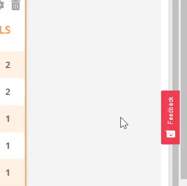

## Dashboard Widgets

The Dashboard drills down into user performance and call reports, giving valuable insight into resolution times, response rates and optimal service times.

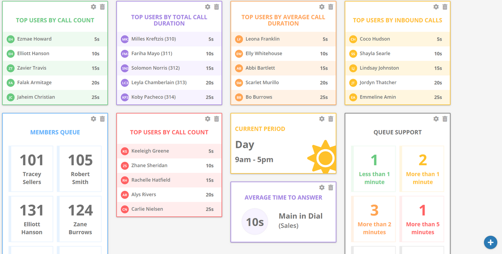

### Create a new Dashboard

From the left hand menu, click the  '**Home**' button.

On the top right hand corner click the '**Action**' button, then click '**Add**'.

Select '**Blank Dashboard**'.

Name your new Dashboard and click the  button.

### Adding Widgets

To add widgets to the Dashboard, click the  button.

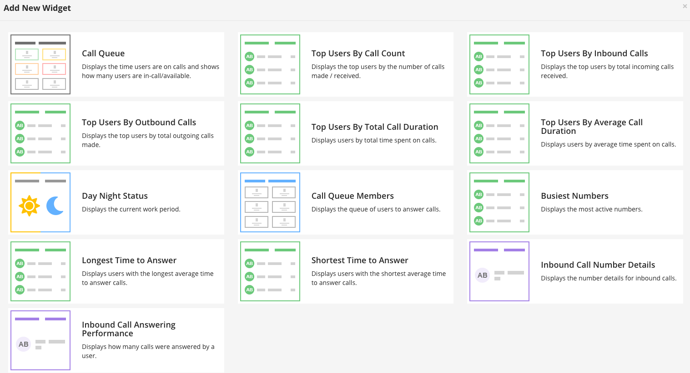

When you select a widget, you may be asked to choose some additional settings. Do so, then click the  button.

### Unique URL for Wallboards

You can also generate a unique URL for each specific Dashboard, allowing you to keep a close eye on your statistics.

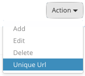

On the top right hand corner click the '**Action**' button, then click '**unique URL**'.

Copy the URL that is provided and open it on any web browser.

## Real Time Status Widget Page

The '*Real Time Status*' widget allows you to keep a close eye on your call queues.

## Adding the 'Real Time Status' Dashboard

From the left hand menu, click the  '**Home**' button.

On the top right hand corner click the '**Action**' button, then click '**Add**'.

Select '**Real Time Status**'.

* Select the PBX from the dropdown list and click the  button.
* Add a description. This will show as the name of the tab.

### Navigation

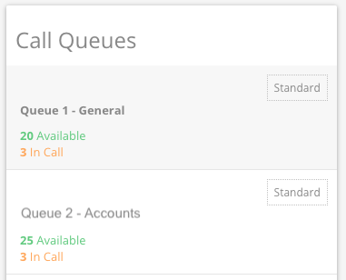

If you have more than one call queue running you can choose between them from the left hand menu.

::: tip
You can also see the 'queue type' listed here.
:::

### Statistics

Here you can see the following information:

* **Total Calls:** Total number of calls entering this queue today.
* **Lost Calls:** Number of calls that entered the queue today that hung up and were not answered. All  Lost calls shown here will also be visible on the Lost call report.

::: tip

 Click the button for 'Lost' to see a list of Lost calls for today.
  
:::

* **Timed Out / Exits:** Number of calls that entered the queue today, were not answered and progressed to the next activity. If the caller uses the 'press 1 to leave a voicemail' option, this will count towards the 'timed out/ exits' tally.

::: tip

 A call that times out, is not classified as Lost.

  :::
* **Avg. Wait Time:** Average time callers waited prior to being answered.
* **Avg. Talk Time:** Average time spent talking on calls answered in this queue.

### Agent Status Information

Here you can see the following information:

* **Name:** Displays the name of the agent.
* **Extension:** Displays the extension number of the Agent.
* **Talking to:** Displays the caller ID (where available) of the person the agent is speaking with.
* **Time In Call:** Displays the total time the agent has been on their current call.
* **Call Status:** Will show as either '**Available**' or '**In Call**', or '**Held**'.

### Calls In Queue Information

Here you can see the following information: 

* **Start Time:** This is the time the caller entered this call queue.
* **Caller ID:** Displays the caller ID (where available) of the person waiting in the queue.
* **Waiting Time:** Displays the total time each caller has been waiting (in the current queue). 

:::tip 
Each call queue will have it's own '**Waiting time**'.
:::

## Call Reports

### Reporting Terminology

<table>
<thead>
  <tr>
    <th>  Term </th>
    <th>  Description </th>
  </tr>
</thead>
<tbody>
  <tr>
    <td>  Calls </td>
    <td>  Calls received or made including inbound, outbound or internal on myCloudPBX. </td>
  </tr>
  <tr>
    <td>  Session </td>
    <td>  Each time a User, identified by an Extension Number, talks on a call a “Session” is created with that User for them to talk.   E.g., An Inbound call is answered by User 1 then transferred to User 2, then transferred to User 3, then the call is terminated by either party = 3 Sessions. </td>
  </tr>
  <tr>
    <td>  Target Number </td>
    <td>  A Target Number is the number that was dialled to. For an Inbound Call the Target Number will be a number on myCloudPBX.   For an outbound call the Target Number will be the remote number the User on myCloudPBX dialled. </td>
  </tr>
  <tr>
    <td>  Origin Number </td>
    <td>  The number a call was made (originated) from. </td>
  </tr>
</tbody>
</table>

#### Rate Types

<table>
<thead>
  <tr>
    <th>  Rate Type </th>
    <th>  Rate Description </th>
    <th>  Country </th>
  </tr>
</thead>
<tbody>
  <tr>
    <td>  1 </td>
    <td>  Local calls to land lines </td>
    <td>  Australia </td>
  </tr>
  <tr>
    <td>  2 </td>
    <td>  National calls to land lines outside the local call area </td>
    <td>  Australia </td>
  </tr>
  <tr>
    <td>  3 </td>
    <td>  International calls </td>
    <td>  Australia </td>
  </tr>
  <tr>
    <td>  4 </td>
    <td>  Mobile calls </td>
    <td>  Australia </td>
  </tr>
  <tr>
    <td>  5 </td>
    <td>  13/1300 and other miscellaneous calls </td>
    <td>  Australia </td>
  </tr>
  <tr>
    <td>  7 </td>
    <td>  1800 calls </td>
    <td>  Australia </td>
  </tr>
  <tr>
    <td>  51 </td>
    <td>  Local Calls to landlines </td>
    <td>  New Zealand </td>
  </tr>
  <tr>
    <td>  52 </td>
    <td>  National calls to landlines </td>
    <td>  New Zealand </td>
  </tr>
  <tr>
    <td>  53 </td>
    <td>  International calls </td>
    <td>  New Zealand </td>
  </tr>
  <tr>
    <td>  54 </td>
    <td>  Mobile calls </td>
    <td>  New Zealand </td>
  </tr>
  <tr>
    <td>  57 </td>
    <td>  0800 calls </td>
    <td>  New Zealand </td>
  </tr>
</tbody>
</table>

### Inbound Calls

The '**Inbound Calls**' report shows the total number of incoming calls answered by a user, filtered by the phone number & time period selected.

* Select any time period with a maximum of 7 days between them.
* Choose any phone number, or all phone numbers.

Click  to download a copy in CSV format.

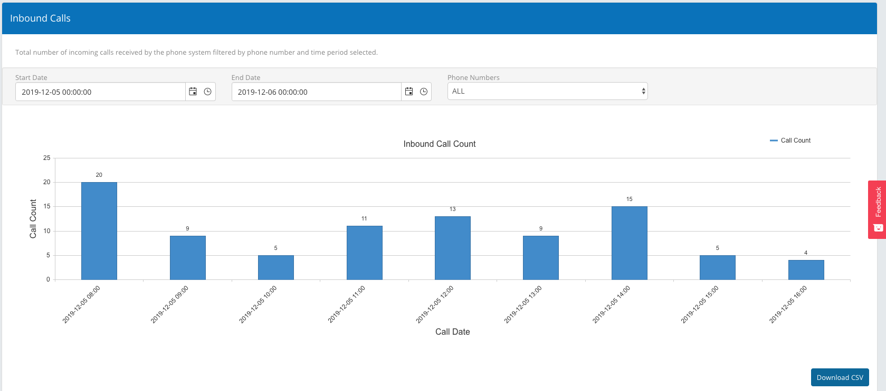

#### Inbound Calls - Summary Report

The Inbound Calls _Summary Report_ summarises calls to Phone Numbers configured in myCloudPBX for call routing.

<table>
<thead>
  <tr>
    <th>  Column Name </th>
    <th>  Description </th>
  </tr>
</thead>
<tbody>
  <tr>
    <td>  CallAlertName </td>
    <td>  The Label name given to the specific Call Route for the Target Number as set in the Call Routing section of the myCloudPBX configuration portal and shown in the Reporting Dashboard. </td>
  </tr>
  <tr>
    <td>  TargetNumber </td>
    <td>  The Number configured on the myCloudPBX the inbound caller dialled. </td>
  </tr>
  <tr>
    <td>  TotalAnsweredCalls </td>
    <td>  The Total Number of Answered calls. </td>
  </tr>
  <tr>
    <td>  TotalCallsNoUsers </td>
    <td>  Total number of calls to the Target Number that were not answered by a User on the myCloudPBX Phone System. </td>
  </tr>
  <tr>
    <td>  TotalCalls </td>
    <td>  The total number of Inbound Calls presented to the myCloudPBX. </td>
  </tr>
  <tr>
    <td>  TotalTalkTimeAllUsers </td>
    <td>  aggregate talk time for all Users talking on calls to the Target Number. </td>
  </tr>
  <tr>
    <td>  AverageTalkTimePerUser </td>
    <td>  Average Talk Time of each User who talked on calls to the Target Number. </td>
  </tr>
  <tr>
    <td>  TotalRingTimeAllUsers </td>
    <td>  Total time User handsets rang prior to being answered, for all Users who answered calls to the Target Number. </td>
  </tr>
  <tr>
    <td>  AverageRingTimePerUser </td>
    <td>  Average Time Users’ handsets rang prior to being answered for all Users who answered calls to the Target Number.  </td>
  </tr>
  <tr>
    <td>  AverageCallTimeToAnswer </td>
    <td>  Average Time taken for calls to the Target Number to be answered between arriving at myCloudPBX and when the first User spoke.    This field is not yet populated and is reserved for future use. </td>
  </tr>
  <tr>
    <td>  TotalCallTimeToAnswer </td>
    <td>  Aggregate Time calls to the Target Number spent in the myCloudPBX before being answered by the first user for each call, is included in this total.    This field is not yet populated and is reserved for future use.</td>
  </tr>
  <tr>
    <td>  TotalVoicemail </td>
    <td>  Total number of calls to the Target Number that entered Voicemail. </td>
  </tr>
</tbody>
</table>

#### Inbound Calls - Detailed Report

The Inbound Calls _Detailed Report_ provides detailed per call information for Inbound calls within myCloudPBX.

<table>
<thead>
  <tr>
    <th>  Column Name </th>
    <th>  Description </th>
  </tr>
</thead>
<tbody>
  <tr>
    <td>  CallGUID </td>
    <td>  The Call GUID is a Global Unique Identifier for that call. </td>
  </tr>
  <tr>
    <td>  CallDateTime </td>
    <td>  The Date and Time for the call. </td>
  </tr>
  <tr>
    <td>  CallDuration </td>
    <td>  The Duration of the Call in seconds from the time the call arrives at myCloudPBX until it is disconnected. </td>
  </tr>
  <tr>
    <td>  OriginNumber </td>
    <td>  The Number of the Caller, if known (maybe set as Private). </td>
  </tr>
  <tr>
    <td>  TargetNumber </td>
    <td>  The Number configured on the myCloudPBX the Inbound caller dialled. </td>
  </tr>
</tbody>
</table>

### Lost Calls

The '**Lost Calls**' Report provides reporting on Incoming calls received by the phone system that were not answered by a user, with options to tailor the report with phone number, time period, and voicemail toggling filters.

**Note:** Calls that go to Virtual Fax, or the conference bridge should not appear in this report.

* Select any time period with a maximum of 7 days between them.
* Tick the checkbox if you wish to include calls that went to voicemail.

Click  to download a copy in CSV format.

#### Lost Calls - Summary Report

The _Lost Calls Summary Report_ summarizes calls to Phone Numbers configured in myCloudPBX for call routing that were not answered by a User or went to Voicemail.

<table>
<thead>
  <tr>
    <th>  Column Name </th>
    <th>  Description </th>
  </tr>
</thead>
<tbody>
  <tr>
    <td>  CallAlertName </td>
    <td>  The Label name given to the specific Call Route for the Target Number as set in the Call Routing section of the myCloudPBX configuration portal and shown in the Reporting Dashboard.</td>
  </tr>
  <tr>
    <td>  TargetNumber </td>
    <td>  The Number configured on the myCloudPBX the Inbound Caller dialled. </td>
  </tr>
  <tr>
    <td>  TotalCalls </td>
    <td>  The total number of calls to the Target Number across the reporting period. </td>
  </tr>
  <tr>
    <td>  TotalLostCalls </td>
    <td>  Total number of calls to the Target Number that were not answered by a User on the myCloudPBX Phone System, across the reporting period. </td>
  </tr>
  <tr>
    <td>  LostCallsPercentage </td>
    <td>  Percentage of calls that were Lost made to the Target Number across the reporting period. </td>
  </tr>
</tbody>
</table>

#### Lost Calls - Detailed Report

The _Lost Calls Detailed Report_ provides detailed per call information for answered calls within myCloudPBX.

<table>
<thead>
  <tr>
    <th>  Column Name </th>
    <th>  Description </th>
  </tr>
</thead>
<tbody>
  <tr>
    <td>  CallGuid </td>
    <td>  The Call GUID is a Global Unique Identifier for that call </td>
  </tr>
  <tr>
    <td>  CallDateTime </td>
    <td>  The Date and Time for the call. </td>
  </tr>
  <tr>
    <td>  CallDuration </td>
    <td>  The duration of the call in seconds from the time the call arrives at myCloudPBX until it is disconnected. </td>
  </tr>
  <tr>
    <td>  OriginNumber </td>
    <td>  The number of the Caller, if known (maybe set as Private). </td>
  </tr>
  <tr>
    <td>  TargetNumber </td>
    <td>  The Number configured on the myCloudPBX the Inbound Caller dialled. </td>
  </tr>
  <tr>
    <td>  CallRouteName </td>
    <td>  The Label name given to the specific Call Route for the Target Number as set in the Call Routing section of the myCloudPBX configuration portal and shown in the Reporting Dashboard.    This field is not yet populated and is reserved for future use. </td>
  </tr>
  <tr>
    <td>  LostInIVR </td>
    <td>  Field is set to value of 1 if the call entered the IVR and the Caller terminated the call before exiting the IVR. </td>
  </tr>
  <tr>
    <td>  LostinQueue </td>
    <td>  Field is set to value of 1 if the call entered a call queue and the Caller terminated the call without speaking to a user before exiting a queue. </td>
  </tr>
  <tr>
    <td>  Voicemail </td>
    <td>  Field is set to value of 1 if the call was sent to voicemail. </td>
  </tr>
</tbody>
</table>

### Outbound Calls

The '**Outbound Calls**' report provides reporting on outgoing calls grouped into their billable rate type, with options to tailor the report to a specific date range.

Report results can be filtered by simply clicking on the Call Type labels in the legend.

* Select any time period with a maximum of 7 days between them.
* Report can be filtered by clicking on the labels in the legend on the right hand side.
* Hover over the bar graph to see the exact number of calls.

Click  to download a copy in CSV format.

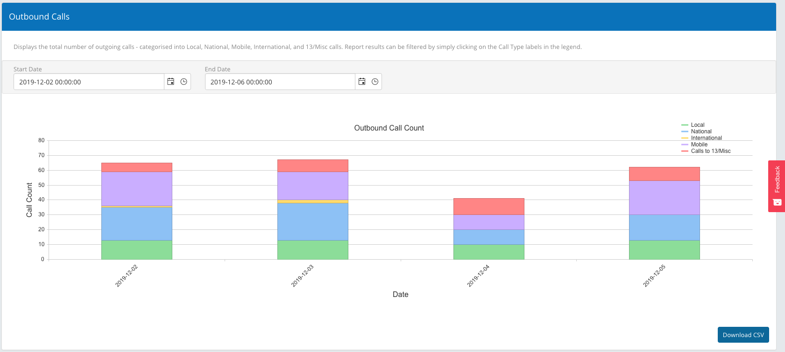

#### Outbound Calls - Detailed Report

<table>
<thead>
  <tr>
    <th>  Column Name </th>
    <th>  Description </th>
  </tr>
</thead>
<tbody>
  <tr>
    <td>  RateType </td>
    <td>  The numeric identifier based on the type of call.    For example 1 is an Australian Local Call. </td>
  </tr>
  <tr>
    <td>  RateDescription </td>
    <td>  Description of the Rate type for the Outbound Call type.   For example if the Rate Type was 4 the description would be ‘Mobile Calls’. </td>
  </tr>
  <tr>
    <td>  RateCountry </td>
    <td>  The Country name for the relevant Rate Type.    For example “Australia” for Rate Type 1, being an Australian Local Call. </td>
  </tr>
  <tr>
    <td>  CallDateTime </td>
    <td>  The Call Date and Time </td>
  </tr>
  <tr>
    <td>  TotalCallCount </td>
    <td>  Total number of outbound calls for that Rate Type. </td>
  </tr>
</tbody>
</table>

### Auto Attendant

The '**Auto Attendant**' (often called an IVR) Report CSV Download report allows you to see which option callers are selecting at your voice prompts. 

Select a date range, then select the IVR and click '**Update**'.

Select any time period with a maximum of 7 days between them.
Report can be filtered by clicking on the labels in the legend on the right hand side.
Hover over the bar graph to see the exact number of calls.

<table>
<thead>
  <tr>
    <th>  Column Name </th>
    <th>  Description </th>
  </tr>
</thead>
<tbody>
  <tr>
    <td>  CallGUID </td>
    <td>  The Call GUID is a Global Unique Identifier for that call. </td>
  </tr>
  <tr>
    <td>  CallDateTime </td>
    <td>  The Date and Time for the call. </td>
  </tr>
  <tr>
    <td>  OriginNumber </td>
    <td>  The number of the caller, if known (maybe set as Private). </td>
  </tr>
  <tr>
    <td>  TargetNumber </td>
    <td>  The Number configured on the MyCloudPBX the caller dialled. </td>
  </tr>
  <tr>
    <td>  IvrReference </td>
    <td>  The Name of the IVR configured in myCloudPBX. </td>
  </tr>
  <tr>
    <td>  KeyLabel </td>
    <td>  The label assigned to the IVR option configured in myCloudPBX. </td>
  </tr>
  <tr>
    <td>  FirstExtensionNumber </td>
    <td>  The Extension number of the First User that spoke on the call. </td>
  </tr>
  <tr>
    <td>  FirstExtensionName </td>
    <td>  The name of the First User that spoke on the call. </td>
  </tr>
  <tr>
    <td>  LostInIVR </td>
    <td>  Set to 1 if the call entered the IVR and the Caller terminated the call before exiting the IVR. </td>
  </tr>
  <tr>
    <td>  TimeoutInIVR </td>
    <td>  Set to 1 if the call entered the IVR and the IVR timed out before the Caller selected an IVR option. </td>
  </tr>
  <tr>
    <td>  Voicemail </td>
    <td>  Set to 1 if the call was sent to voicemail. </td>
  </tr>
</tbody>
</table>

### Time to Answer

The '**Time to Answer**' report displays the average time taken for a call to be answered by a user.

* Select any time period with a maximum of 7 days between them.
* Choose a phone number / numbers from the drop down menu.

Click  to download a copy in CSV format.

### Export Call Records

The '**Export Call Records**' report allows you to download an easy to digest csv report.

Select the start and end date ranges as well as the phone number(s).

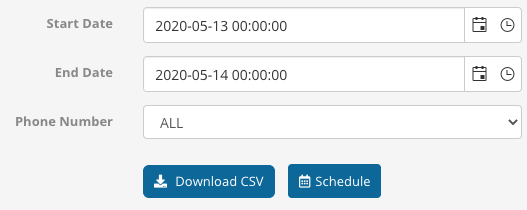

Click  to download a copy in CSV format.

You can also schedule this report by clicking the   button.

<table>
<thead>
  <tr>
    <th>  Column Name </th>
    <th>  Description </th>
  </tr>
</thead>
<tbody>
  <tr>
    <td>  CallGuid </td>
    <td>  The Call GUID is a Global Unique Identifier for that call. </td>
  </tr>
  <tr>
    <td>  CallDateTime </td>
    <td>  The Date and Time for the call. </td>
  </tr>
  <tr>
    <td>  ServiceID </td>
    <td>  myCloudPBX Service ID. </td>
  </tr>
  <tr>
    <td>  ServiceName </td>
    <td>  The official name of the Voice Service. </td>
  </tr>
  <tr>
    <td>  ServiceFriendlyName </td>
    <td>  The User defined name of the Voice Service. </td>
  </tr>
  <tr>
    <td>  Direction </td>
    <td>  The direction of the call.  (Internal, Inbound, Outbound). </td>
  </tr>
  <tr>
    <td>  Dialplan </td>
    <td>  Dialplan Used - AU (Australia), NZ (New Zealand). </td>
  </tr>
  <tr>
    <td>  OriginNumber </td>
    <td>  The number of the Caller, if known. </td>
  </tr>
  <tr>
    <td>  TargetNumber </td>
    <td>  The Number that was called. </td>
  </tr>
  <tr>
    <td>  Jurisdiction </td>
    <td>  Unique numeric Identifier of an International call destination.     This field is not yet populated and is reserved for future use.</td>
  </tr>
  <tr>
    <td>  JurisdictionDescription </td>
    <td>  Jurisdiction Description.    For example Jurisdiction 221 is “Canada”.     This field is not yet populated and is reserved for future use.</td>
  </tr>
  <tr>
    <td>  CallDuration </td>
    <td>  The Duration of the Call including setup and ring time. </td>
  </tr>
  <tr>
    <td>  BillableTime </td>
    <td>  The total Billable Time for the call. Only Outbound calls will have a billable time. </td>
  </tr>
  <tr>
    <td>  TimeToAnswer </td>
    <td>  The time taken from when the call arrives at myCloudPBX until the call is answered by a User. </td>
  </tr>
  <tr>
    <td>  RateType </td>
    <td>  The numeric identifier based on the type of call.     For example 1 is an Australian Local Call. </td>
  </tr>
  <tr>
    <td>  RateDescription </td>
    <td>  Description of the Rate type for the outbound call type.   For example if the Rate Type was 4 the description would be ‘Mobile Calls’. </td>
  </tr>
  <tr>
    <td>  RateCountry </td>
    <td>  The country name for of the relevant Rate Type.    For example “Australia” for Rate Type 1, being an Australian Local Call. </td>
  </tr>
  <tr>
    <td>  HangupReason </td>
    <td>  The hangup reason for the call. </td>
  </tr>
  <tr>
    <td>  UserAgent </td>
    <td>  The User agent (phone type) for the First Talker. This field will contain whatever UserAgent myCloudPBX received from the remote device. </td>
  </tr>
  <tr>
    <td>  AccountCode </td>
    <td>  When the Account Code Dialling feature on myCloudPBX is enabled this is the optional Account Code used for the outbound call. </td>
  </tr>
  <tr>
    <td>  RTPMOS </td>
    <td>  Call quality rating - MOS - Mean Opinion Score, rating of 1 through 5 (5 being the best).   When using the G711 codec, the RTP MOS value can be as high as 4.5.   When using the G729 codec, the RTP MOS value can be as high as 3.9. </td>
  </tr>
  <tr>
    <td>  RTPQuality </td>
    <td>  Call quality percentage rating. </td>
  </tr>
  <tr>
    <td>  UserExtension </td>
    <td>  The extension number of the user that made or received the call. If more than one user spoke on the call, this is the first user who spoke. </td>
  </tr>
  <tr>
    <td>  UserName </td>
    <td>  The name of User as set up in the configuration of myCloudPBX. </td>
  </tr>
  <tr>
    <td>  OfficeName </td>
    <td>  The name of the Office as set up in the configuration of myCloudPBX. This is the office the User (UserExtension) is located in. If more than one User spoke on the call, this is the office associated to the First User who spoke. </td>
  </tr>
  <tr>
    <td>  UserIPOwner </td>
    <td>  The details of the IP Address Holder (Service Provider) for the IP Address of the device the User (UserExtension) connected from, if known.   If more than one User spoke on the call, this is the IP Owner related to the First User. </td>
  </tr>
  <tr>
    <td>  UserIPAddress </td>
    <td>  The IP Address of the device the User (UserExtension) connected from, if known. If more than one User spoke on the call, this is the first User who spoke. </td>
  </tr>
  <tr>
    <td>  Voicemail </td>
    <td>  Field is set to value of 1 if the call was sent to voicemail. </td>
  </tr>
</tbody>
</table>

### Cost Allocation

Account codes are used to attribute calls to either a user or group of users.  Alternatively, account codes can be used to attribute calls made to your customers. 

When a call is made, you can enter the account code as part of the phone number.  The code will show up in the CDR (Call Detail Recording) with call length, number dialled etc.  The CDR record is written when you terminate the call.

This functionality would typically be used by anyone who bills specifically for their time, eg: lawyers.

#### Usage

The '**Account Code**' report takes each call with account codes and assigns them a dollar value.

* Specify the start & end date ranges.
* Assign the following values to each of the call types:

  * **Unit:** Choose from 1 second, 30 seconds, or 1 minute increments.
  * **Cost:** Enter the cost (per unit) in cents.
  * **Minimum:** Enter the minimum call cost, in cents.
  * **Flagfall:** Enter the flagfall rate here. (This is the cost that is applied once the call is connected.

Click  to save your settings.

* Choose from Excel or PDF format, then download either the '**Summary**' or '**Detailed**' report.

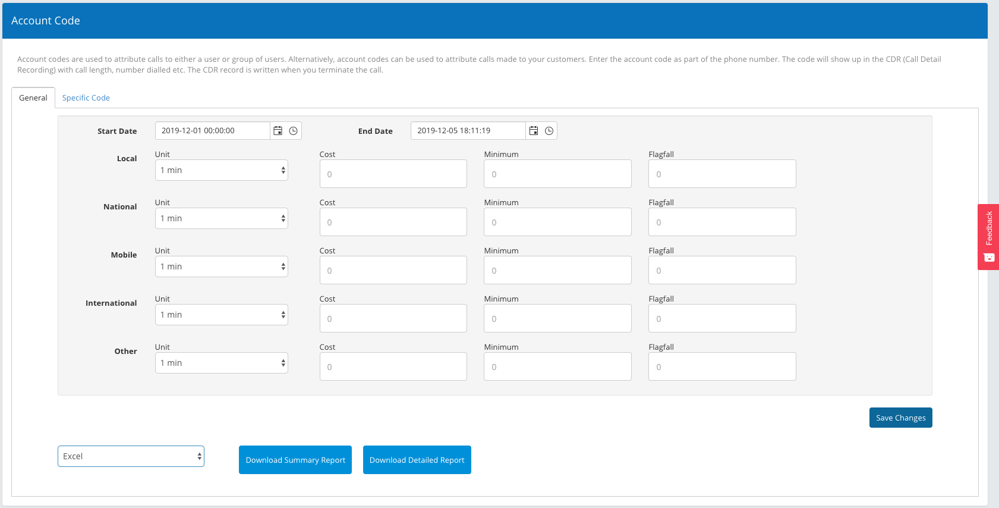

### Call Recordings

The '**Call Recordings**' page allows you to play or download recorded calls. Calls can be searched by the calling number (origin), or the called number (target).

* Select the start & end dates.
* Enter a number to search (if required)

Click  

Once the data has loaded, you will be able to see the following information about each call:

* **Origin:** This is the source number.
* **Target:** This is the destination number.
* **Duration (sec):** Duration of the call, measured in seconds.
* **Call Date:** Date / Timestamp of the call.
* **Download:** Click here to download a copy of the call recording.
* **Play:** Click here to play the recording.

::: warning

 Call Recordings are stored for 90 days only

:::

## User Reports

### Active Users

The '**Active Users**' report shows the total time users spent on calls.  Reports are filtered by the direction of the call, the office, and time period selected.

* Select any time period with a maximum of 7 days between them.
* Select your '**Call Direction**':

  * All
  * Internal (This will only display calls made internally.
  * Inbound (This will only display ***inbound calls***. (calls that you answered).
  * Outbound (This will only display ***outbound calls*** (calls that you made).  
  * Select the '**office**', or simply select '*all offices*'.

**Group by:**
You can choose to group by extension number, or by the users' name by using the  slider.

::: tip

You can also choose between a **bar graph** and a **pie chart** by clicking the button in the top right hand corner of the graph.

:::

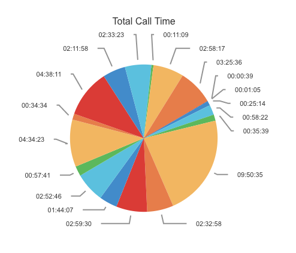

<table>
<thead>
  <tr>
    <th>  Column Name </th>
    <th>  Description </th>
  </tr>
</thead>
<tbody>
  <tr>
    <td>  UserExtension </td>
    <td>  The extension number of the User. </td>
  </tr>
  <tr>
    <td>  UserName </td>
    <td>  The name of User as set up in the configuration of myCloudPBX. </td>
  </tr>
  <tr>
    <td>  TotalSessionCount </td>
    <td>  The total number of times the User spoke on calls.   </td>
  </tr>
  <tr>
    <td>  InboundSessionCount </td>
    <td>  Total number of times the User spoke on Inbound calls.  </td>
  </tr>
  <tr>
    <td>  OutboundSessionCount </td>
    <td>  Total number of times the User spoke on Outbound calls. </td>
  </tr>
  <tr>
    <td>  TotalUserTalkTIme </td>
    <td>    Total time the User spent talking on the phone. </td>
  </tr>
  <tr>
    <td>  TotalOverallUserTime </td>
    <td>  Total time the User’s extension/s rang and/or spoke on the phone. </td>
  </tr>
  <tr>
    <td>  AvgUserTalkTime </td>
    <td>  The Average time the User spoke on each session. </td>
  </tr>
  <tr>
    <td>  AvgOverallUserTime </td>
    <td>  The average Overall time the User’s extension both rang and/or spoke.  </td>
  </tr>
  <tr>
    <td>  OriginOffice </td>
    <td>  The Office Name as labelled in myCloudPBX. </td>
  </tr>
</tbody>
</table>

::: tip
**FAQ:** Why is there a discrepancy between the TotalSessionCount and (InboundSessionCount + OutboundSessionCount)?

**Answer:** TotalSessionCount can include internal calls, such as call transfers and conference calls which can lead to a higher value.
:::
### Total Call Count

The '**Total Call Count**' report shows the total number of calls each user made or received, filtered by the office and time period selected.

* Select any time period with a maximum of 7 days between them.
* Select your '**Call Direction**':

  * All
  * Internal (This will only display calls made internally.
  * Inbound (This will only display ***inbound calls***. (calls that you answered).
  * Outbound (This will only display ***outbound calls*** (calls that you made). 
* Select the '**office**', or simply select '*all offices*'.

**Group by:**
You can choose to group by extension number, or by the users' name by using the  slider.

<table>
<thead>
  <tr>
    <th>  Column Name </th>
    <th>  Description </th>
  </tr>
</thead>
<tbody>
  <tr>
    <td>  UserExtension </td>
    <td>  The extension number of the User. </td>
  </tr>
  <tr>
    <td>  UserName </td>
    <td>  The name of User as set up in the configuration of myCloudPBX. </td>
  </tr>
  <tr>
    <td>  TotalSessionCount </td>
    <td>  The total number of times the User spoke on calls.  </td>
  </tr>
  <tr>
    <td>  InboundSessionCount </td>
    <td>  Total number of times the User spoke on Inbound calls.  </td>
  </tr>
  <tr>
    <td>  OutboundSessionCount </td>
    <td>  Total number of times the User spoke on Outbound calls. </td>
  </tr>
  <tr>
    <td>  TotalUserTalkTIme </td>
    <td>    Total time the User spent talking on the phone. </td>
  </tr>
  <tr>
    <td>  TotalOverallUserTime </td>
    <td>  Total time the User’s extension/s rang and/or spoke on the phone. </td>
  </tr>
  <tr>
    <td>  AvgUserTalkTime </td>
    <td>  The Average time the User spoke on each session. </td>
  </tr>
  <tr>
    <td>  AvgOverallUserTime </td>
    <td>  The average Overall time the User’s extension both rang and/or spoke.  </td>
  </tr>
  <tr>
    <td>  OriginOffice </td>
    <td>  The Office Name as labelled in myCloudPBX. </td>
  </tr>
</tbody>
</table>

::: tip
**FAQ:** Why is there a discrepancy between the TotalSessionCount and (InboundSessionCount + OutboundSessionCount)?

**Answer:** TotalSessionCount can include internal calls, such as call transfers and conference calls which can lead to a higher value.
:::
### Average Call Duration

The '**Average Call Duration**' report displays the average time each user spent on a call. Reports are filtered by the direction of the call, the office, and the time period selected.

* Select any time period with a maximum of 7 days between them.
* Select your '**Call Direction**':

  * All
  * Internal (This will only display calls made internally.
  * Inbound (This will only display ***inbound calls***. (calls that you answered).
  * Outbound (This will only display ***outbound calls*** (calls that you made). 
* Select the '**office**', or simply select '*all offices*'.

::: tip

 You can also choose between a **bar graph** and a **pie chart** by clicking the button in the top right hand corner of the graph.

:::

**Group by:**
You can choose to group by extension number, or by the users' name by using the  slider.

<table>
<thead>
  <tr>
    <th>  Column Name </th>
    <th>  Description </th>
  </tr>
</thead>
<tbody>
  <tr>
    <td>  UserExtension </td>
    <td>  The extension number of the User. </td>
  </tr>
  <tr>
    <td>  UserName </td>
    <td>  The name of User as set up in the configuration of myCloudPBX. </td>
  </tr>
  <tr>
    <td>  TotalSessionCount </td>
    <td>  The total number of times the User spoke on calls.  </td>
  </tr>
  <tr>
    <td>  InboundSessionCount </td>
    <td>  Total number of times the User spoke on Inbound calls.  </td>
  </tr>
  <tr>
    <td>  OutboundSessionCount </td>
    <td>  Total number of times the User spoke on Outbound calls. </td>
  </tr>
  <tr>
    <td>  TotalUserTalkTIme </td>
    <td>    Total time the User spent talking on the phone. </td>
  </tr>
  <tr>
    <td>  TotalOverallUserTime </td>
    <td>  Total time the User’s extension/s rang and/or spoke on the phone. </td>
  </tr>
  <tr>
    <td>  AvgUserTalkTime </td>
    <td>  The Average time the User spoke on each session. </td>
  </tr>
  <tr>
    <td>  AvgOverallUserTime </td>
    <td>  The average Overall time the User’s extension both rang and/or spoke.  </td>
  </tr>
  <tr>
    <td>  OriginOffice </td>
    <td>  The Office Name as labelled in myCloudPBX. </td>
  </tr>
</tbody>
</table>

::: tip
**FAQ:** Why is there a discrepancy between the TotalSessionCount and (InboundSessionCount + OutboundSessionCount)?

**Answer:** TotalSessionCount can include internal calls, such as call transfers and conference calls which can lead to a higher value.
:::
## Scheduled Reporting

Scheduled Reporting allows you to create a report and receive it in your inbox when you need it.

If a report is available for scheduling, you will see this button: 

### Creating a report

Click the  button to create your report.

* **Report:** This is the report type.
* **Friendly Name:** This is your name for the report.
* **Email:** Add as many email recipients as required.
* **Schedule:** Choose from Daily, Weekly, or Monthly.

  * **Daily:** Select the days you wish to receive the report.
  * **Weekly:** Choose the day of the week you wish to receive the report.
  * **Monthly:** Choose the day of the month you wish to receive the report.
* **Report State:** Use the toggle switch to choose from ON or OFF.
* **Period:** Choose from the last 7 days, 14 days, or the last month.
* **Direction:** Choose from Inbound, Outbound, Internal, or All Calls.
* **Offices:** Choose from a specific office, or all offices.

When you are finished, click the  button.

### View / Modify Existing Reports

Click **Scheduled Reports** from the left hand menu.

Here you can see the reports scheduled for the PBX including the report type, schedule, operating status, and the date last run.

* To edit a report, click .
* Use the toggle switches to enable or disable a report.
* To delete a report, click .

## Virtual Fax Archive

The '**Virtual Fax Archive**' allows you to download your inbound Fax.

Click the '**Download**' button to download a copy of the PDF.

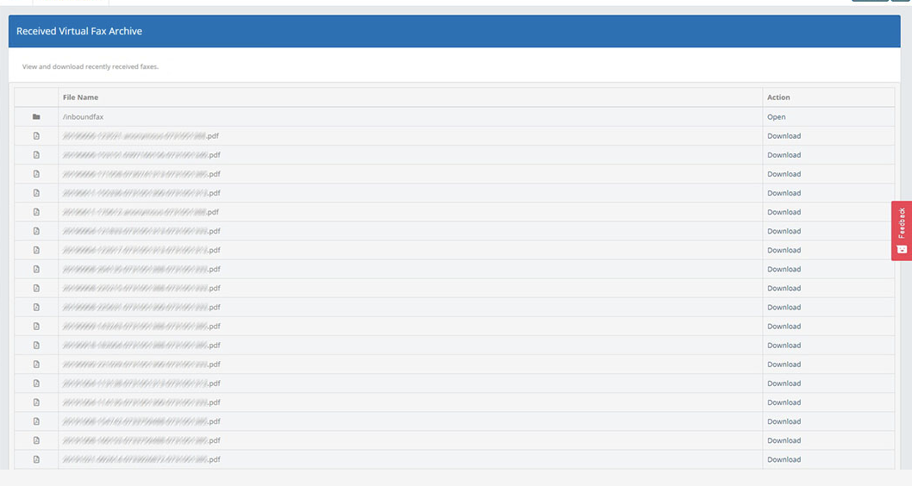

::: warning
Fax are stored for 90 days only
:::
