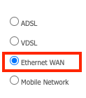
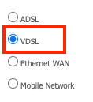
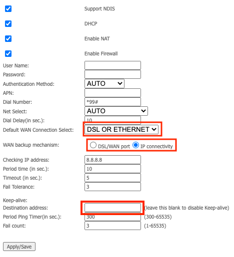
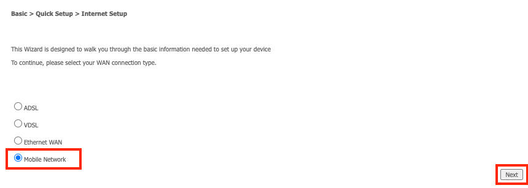
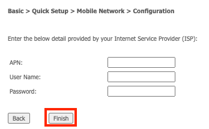

# Internet Services

## General Settings

General Internet Services Settings

**DNS Servers**

* **Server 1:** 202.3.111.123
* **Server 2:** 202.3.111.124

**Email Server Settings**

* **Outbound Mail Server:** mail.ecn.net.au
* **Port:** 25
* **Authentication:** None
* **Note:** Only available for users with an ECN IP Address.

**Proxy Server**

* **Proxy Server Address:** 203.22.70.5
* **Port:** 80
::: tip
Proxy Server is only available for users whith an ECN provided Internet Connection
:::

## Netcomm NF18ACV

This page will help you configure your **Netcomm NF18ACV** to work with your Cadiz3 provided Internet connection.

### Netcomms Management Interface

**Prerequisites:**

* Netcomm NF18ACV, plugged in and powered on. 
* Netcomm must be plugged into your computer with the provided Ethernet cable.(This cable must be plugged into one of the yellow LAN ports on the modem) 

Alternatively, you can use the provided wifi details on the provided card to connect your computer wirelessly to the modem. 

::: tip
TIP: You can also find the default WiFi username / password on the bottom of the modem stand).
:::

Please note that you may not have internet connection even after connecting to the modem if the modem had not been configured by Cadiz3 . 

All modems / routers sent from Cadiz3  are preconfigured to connect and therefore you don’t need to be reconfigured.

The default IP Address of the Netcomm NF18ACV is **192.168.20.1**.

Open your web browser and type in **192.168.20.1** in the address bar as shown in the above image.

The modem comes default with the following username & password.

* **Username:** admin
* **Password:** admin

::: warning
It is highly recommended that you change this password!
:::

Click '**_Login_**'.

### Configuring for NBN FTTN

- - -

**Prerequisites:** 

* Fibre to the Node NBN connection provided by Cadiz3 .
* Netcomm NF18ACV

From the Netcomm homepage, click on '**_Internet_**' on the left hand column and then click on '**_Create New_**'.

You will need to enter in the following information:

* **Description**: This is for your reference only.
* **Internet Service**: Choose 'VDSL'.
* **Connection Type**: Choose 'PPPoE'.
* **Username**: Enter the username provided by Cadiz3 .
* **Password**: Enter the password provided by Cadiz3 .
* **802.1P:** Leave unchanged at -1
* **VLAN Tag:** Leave unchanged at -1 (unless advised specifically by Cadiz3 ).
  ::: tip
  If you do not know your username & password, contact Cadiz3  on 1300 933 217.
  :::
  Click 'Apply'.

If everything has been plugged in correctly, you should have Internet access within 60 seconds.

You will see the '_**DSL**_' indicator light go solid on the modem, and the '_**Internet**_' will follow shortly.

You are now connected to the Internet!

### Configuring for NBN FTTP or HFC

- - -

**Prerequisites:** 

* HFC or FTTP NBN connection provided by Cadiz3 .
* Netcomm NF18ACV

From the Netcomm homepage, click on '**_Internet_**' on the left hand column and then click on '**_Create New_**'.

You will need to enter in the following information:

* **Description**: This is for your reference only.
* **Internet Service**: Choose 'Ethernet WAN'.
* **Connection Type**: Choose 'PPPoE'.
* **Username**: Enter the username provided by Cadiz3 .
* **Password**: Enter the password provided by Cadiz3 .
* **802.1P:** Leave unchanged at -1
* **VLAN Tag:** Leave unchanged at -1 (unless advised specifically by Cadiz3 ).
  ::: tip
  If you do not know your username & password, contact Cadiz3  on 1300 933 217.
  :::
  Click 'Apply'.

If everything has been plugged in correctly, you should have Internet access within 60 seconds.

You will see the indicator light go solid on the modem.

You are now connected to the Internet!

### WiFi Settings

The Netcomm NF18ACV comes preconfigured with WiFi and the default username / password can be found in the following locations:

* On the WiFi security card provided with the modem.
* On the bottom of the modem.

::: warning
**Note:** If you have changed your WiFi name / password this will no longer be correct.
:::

#### Changing your WiFi Name & Password

- - -

**Prerequisites:** 

* Netcomm NF18ACV

Log into the Netcomm Management Interface.

From the Netcomm homepage, select '_**Wireless**_'

On this page you will be able to change the '_**Name**_' and password for your WiFi connection.

Click '_**Apply/Save**_' when you are finished.

### Changing Admin Credentials

Prerequisites:

* Netcomm NF18ACV

Log into the Netcomm Management Interface and select '**Passwords**' from the '**Management**' menu.

From this page you can change your usernames & passwords that are used to log into the Netcomm Management Interface.

::: tip
You will need to login with the new username / password after you hit save.
:::

Click '_**Apply/Save**_' when you are finished.

### Configuring Voip Service

- - -

**Prerequisites:**

* **Cadiz3  Voip Service:** Authentication ID, Password, & Server Address.
* **Active Internet Connection**
* **SIP ALG MUST be disabled on your router**

Log into the Netcomm Management Interface and select '**SIP Settings**' from the '**Advanced**' page.

Ensure the that '**DTMF Relay Setting**' s set to '**RFC2833**' under _Payload Settings_.

Click '**Apply/Save**'.

Select '**Phone**' from the left hand menu.

Enter the following information:

* **SIP Username:** This is your '_Auth ID_'. (Found in the EMBER Portal).
* **SIP Password:** Found in the EMBER Portal. 
* **Line Number:** This is your '_Auth ID_' again. (Your caller ID will be set in the EMBER Portal.
* **SIP Proxy:** You will set this server address via the EMBER Portal. Enter that as shown here.
* **SIP Proxy Port:** 5060
* **SIP Registrar:** This will be the same as your '**SIP Proxy**.
* **SIP Registrar Port:** 5060
* **SIP Outbound Proxy:** This will be the same as your '**SIP Proxy**'.
* **SIP Outbound Proxy Port:** 5060

When you have filled in all the settings, click '**Apply/Save**'.

Click '**More Settings**'

Ensure that you have set the codec priority as follows (ptime needs to be set to **20ms.**)

**1.** G711A

**2.** G711U

Your SIP service is now registered.

## Netcomm NL19ACV

There are two main ways to configure the Netcomm NL19ACV modem.

* Connect via NBN with optional 4G Backup
* Connect via 4G Only

### Configuring for FTTP, HFC, FTTC, nbn Wireless

**Step 1.** Power modem on.

**Step 2.** Logging into the web interface

* Connect your computer to the Netcomm via an Ethernet Cable.
* Open a web browser and type **http://192.168.20.1** into the address bar and press '**Enter**'.
* When prompted for authentication, type **admin** into the Username field.
* The password is printed on the back of the modem. This will be either **admin** OR the serial number of the modem.
* Click '**OK**' to log in.

**Step 3.** Click 'basic setup'.

**Step 4.** Select '**Ethernet WAN**'

**Step 5.** Click '**Next**'.

**Step 6.** Select '**PPP Over Ethernet (PPPoE)**'.

**Step 7.** Click '**Next**'.

**Step 8.** Select '**No VLAN Tag**'.

**Step 9.** Click '**Next**'.

**Step 10.** Enter your username and password as provided.

::: tip
**Note:** If you wish to enable the 4G Backup option, click '**Enable Mobile Broadband Backup**'
Leave 'Network Name', 'Username', and 'Password' blank.
:::

**Step 11.** Click '**Finish**'.

**Step 12.** Allow up to 10 minutes for the connection to come online. Once completed you will see the '**WAN**' and '**Internet**' lights come online.

You are now connected to the Internet.

### Configuring for NBN FTTN, FTTB

**Step 1.** Power modem on.

**Step 2.** Logging into the web interface

* Connect your computer to the Netcomm via an Ethernet Cable.
* Open a web browser and type **http://192.168.20.1** into the address bar and press '**Enter**'.
* When prompted for authentication, type **admin** into the Username field.
* The password is printed on the back of the modem. This will be either **admin** OR the serial number of the modem.
* Click '**OK**' to log in.

**Step 3.** Click 'basic setup'.

**Step 4.** Select '**VDSL**'

**Step 5.** Click '**Next**'.

**Step 6.** Select '**PPP Over Ethernet (PPPoE)**'.

**Step 7.** Click '**Next**'.

**Step 8.** Select '**No VLAN Tag**'.

**Step 9.** Click '**Next**'.

**Step 10.** Enter your username and password as provided.

::: tip
**Note:** If you wish to enable the 4G Backup option, click '**Enable Mobile Broadband Backup**'
Leave 'Network Name', 'Username', and 'Password' blank.
:::

**Step 11.** Click '**Finish**'.

**Step 12.** Allow up to 10 minutes for the connection to come online. Once completed you will see the '**DSL**' and '**Internet**' lights come online.

You are now connected to the Internet.

### Add 4G Backup to Existing

::: tip
If you have an existing modem configured with NBN, you can enable the 4G backup without resetting your modem.
:::

**Step 1.** Power modem off.

**Step 2.** Insert SIM until it clicks into place.

**Step 3.** Ensure that the two large antennas have been screwed into position on the back of the modem.

**Step 4.** Power modem on.

**Step 5.** Logging into the web interface

* Connect your computer to the Netcomm via an Ethernet Cable.
* Open a web browser and type **http://192.168.20.1** into the address bar and press '**Enter**'.
* When prompted for authentication, type **admin** into the Username field.
* The password is printed on the back of the modem. This will be either **admin** OR the serial number of the modem.
* Click '**OK**' to log in.

**Step 6.** Click '**Advanced Setup**'.

**Step 7.** Click '**Mobile Broadband**'.

**Step 8.** Click '**Add**'.

**Step 9.** Configure the following settings:

* **Default WAN Connection:** DSL OR ETHERNET
* **WAN backup mechanism:** IP Connectivity
* **Keep-alive Destination address:** leave this blank.

**Step 10.** Click '**Apply/Save**'.

Your 4G Backup is now configured.

::: tip
**Note:** The backup service can take up to 5 minutes to turn on if the nbn service goes offline
:::

### Connect with 4G Only

**Step 1.** Power modem off.

**Step 2.** Insert SIM until it clicks into place.

**Step 3.** Ensure that the two large antennas have been screwed into position on the back of the modem.

**Step 4.** Power modem on.

**Step 5.** Logging into the web interface

* Connect your computer to the Netcomm via an Ethernet Cable.
* Open a web browser and type **http://192.168.20.1** into the address bar and press '**Enter**'.
* When prompted for authentication, type **admin** into the Username field.
* The password is printed on the back of the modem. This will be either **admin** OR the serial number of the modem.
* Click '**OK**' to log in.

**Step 6.** Click 'basic setup'.

**Step 7.** Select '**Mobile Network**'.

**Step 8.**  Click '**Next**'.

**Step 9.** Leave all three fields blank, then click '**Finish**'.

**Step 10.** Allow up to 10 minutes for the connection to come online. Once completed you will see the '**LTE**' light come online.

You are now connected to the Internet.

### Troubleshooting 4G

#### 4G Indicator Lights

The '**LTE**' Indicator Light (1) will be illuminated when connected.

Use the '**LTE Signal**' Indicator Lights (2) to check the signal lights.

* 1 Green - The LTE Signal is weak.
* 2 Green - The LTE Signal is medium.
* 3 Green - The LTE Signal is strong.

If the '**LTE Signal**' Indicator Lights (2) are all off, ensure that the SIM is fully inserted and both of the large antennas have been screwed into position on the back of the modem.
