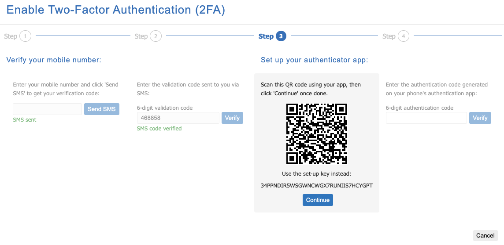

# 2 Factor Authentication (2FA)

- - -

## About 2 Factor
Two-Factor Authentication (2FA) is pivotal in bolstering security as it necessitates multiple forms of verification before granting access. 
 
This approach extends beyond the conventional password-only method by requiring both your username and password, as well as a secure code, adding an extra layer of defense to safeguard your information.

## Configuration

Upon signing into the Portal, you will be prompted to configure 2FA.

Click the link to proceed to enable 2FA.

**Step 1.**

Install an Authenticator App on your phone to get two-factor authentication codes when asked.

Some Authenticator App options are: 

- Google Authenticator
- Microsoft Authenticator
- 1Password
- LastPass

Once you have the authenticator installed on your phone, click '**Continue**' to Start the configuration process.

**Step 3.**

First we need to verify your mobile phone number. This will be used in the event that you lose your Authentication codes.

Enter your mobile phone number, then click '**Send SMS**'.

**Step 4.**

You will have received a 6 digit code sent to your mobile phone. 
Enter this code, then click '**Verify**'.

**Step 5.**

Use the Authenticator App that you installed on your phone in Step 1 to scan the QR Code.
Once complete, Click '**Continue**'.

**Step 6.**

Enter the Authentication Code generated on your phones Authentication App, then click '**Verify**'.

If you have done everything correctly, you will be finished.

Click '**Finish**'.

