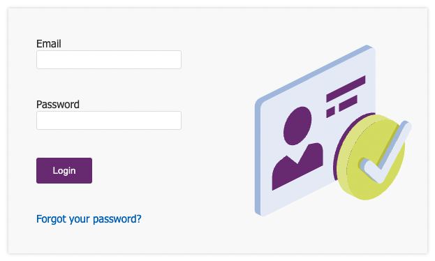
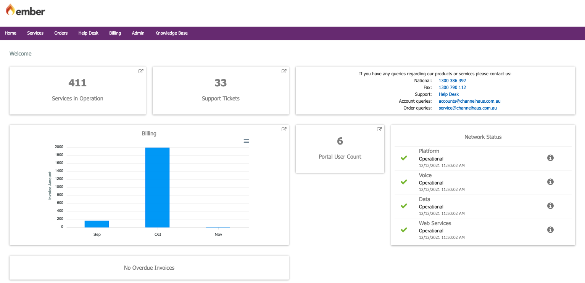
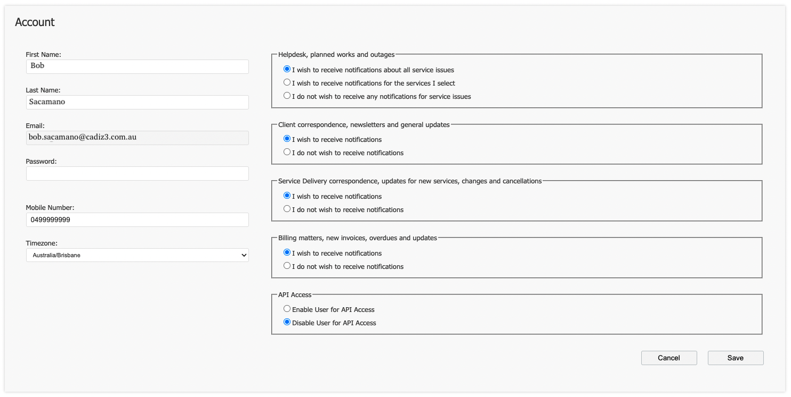
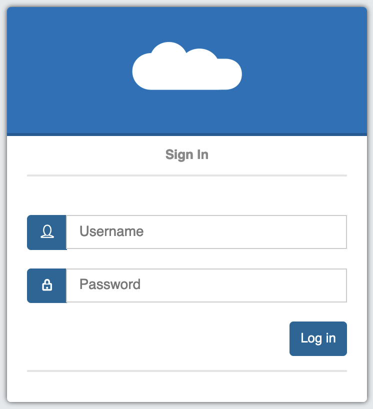

# **Accessing Ember Management Portals**

- - -

To log into the Ember Management Portal, navigate to <a href="https://ember.cadiz3.com.au ">https://ember.cadiz3.com.au </a>and enter your *Username* & *Password*.

Enter your ‘**Email**’ and ‘**Password**’ then click ‘**Login**’ to access the Ignition Portal.

## Forgot your password?

 
<iframe width="560" height="315" src="https://www.youtube.com/embed/QZcIgYuA09Y" title="YouTube video player" frameborder="0" allow="accelerometer; autoplay=0; clipboard-write; encrypted-media; gyroscope; picture-in-picture; web-share" allowfullscreen></iframe>

 

Click ‘**Forgot your password?**’ to reset your password. 

You will receive an email allowing you to reset your password automatically.

## Ember landing page
 
<iframe width="560" height="315" src="https://www.youtube.com/embed/4E6tZYzj50w" title="YouTube video player" frameborder="0" allow="accelerometer; autoplay=0; clipboard-write; encrypted-media; gyroscope; picture-in-picture; web-share" allowfullscreen></iframe>
 
When you first login, you will be greeted by the landing page which gives you a quick overview of your Services, Billing, and the Cadiz3 Network Status.

Click on any of the tiles to quickly access the corresponding page.

## Account Management
At the top right-hand corner of the screen, click on your ‘**Account**’ to modify your user details.
 

Here you can adjust the following information:

•	**First and last name**: Your preferred details.

•	**Email address**: (This is used to access the Ignition Portal, and also for any correspondence you have signed up for, such as Helpdesk, and Billing notifications.)

•	**Password**: Your login password.

•	**Mobile Number**: This will allow us to contact you if required.

•	**Timezone**: This is used to ensure your call detail records are in your preferred timezone.

On the right-hand side of the screen, select the notifications you would like to receive.

Click ‘**Save**’ when finished.

## Reporting Dashboard

The Hosted PBX Dashboard can be used to easily view statistics and pull reports from your PBX.

 

