# **Orders**

- - -

From the orders menu, you can select one of three options.
-	New Order
-	Pricebook
-	Call Tariffs

## New Order

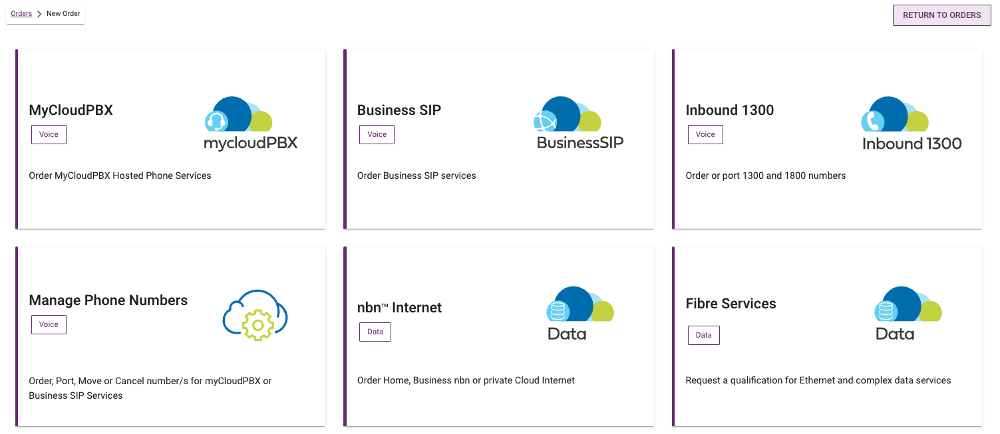

The ‘New Orders’ page allows you to order a number of services.

### MyCloudPBX

Order a new myCloudPBX service.

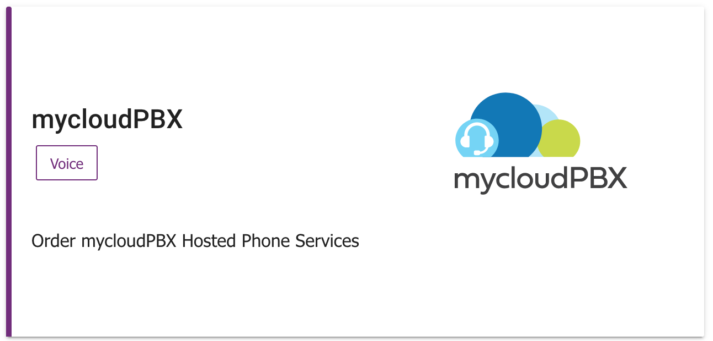

Click the myCloudPBX tile to order a new myCloudPBX service.

#### Step 1
---

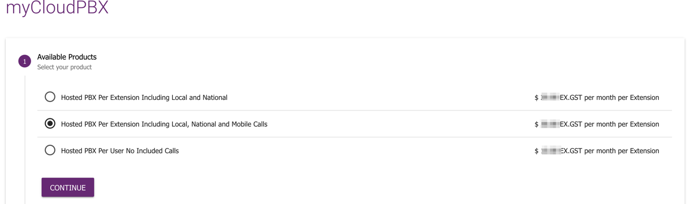

Select your preferred product.

Click '**Continue**' when ready to proceed.

#### Step 2 
---

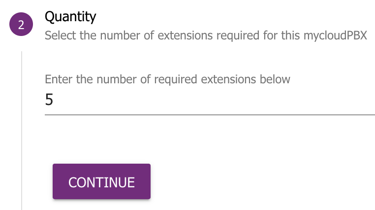

Select the number of extensions that you require for your new PBX.

Click '**Continue**' when ready to proceed.

#### Step 3 
---

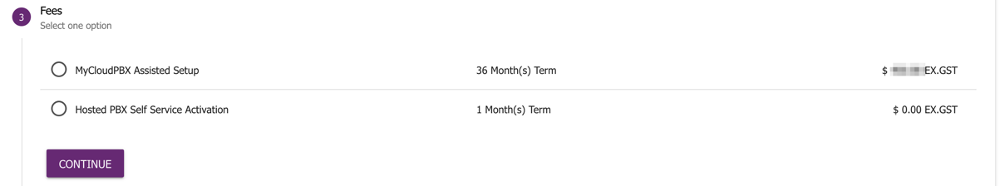

Next you can select from either:

- **Assisted Setup**: One of our specialists will assist you with the configuration of your new PBX.

- **Self Service Activation**: You configure everything yourself.

If you opt for the Assisted Setup option, one of our specialists will contact you to assist with the process once your order has been submitted. 

Click '**Continue**' when ready to proceed.

#### Step 4 
---

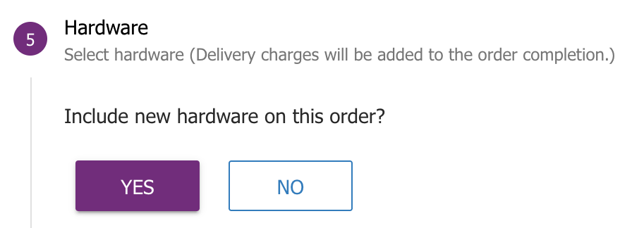

If you would like to include hardware with your order, click **Yes**, if not, skip to the next step.

Use the  and  icons to select the quantities required.

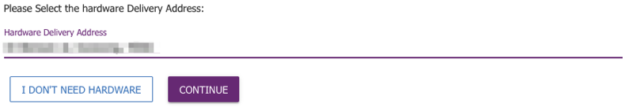

Click '**Continue**', or '**I dont need hardware**' depending on your requirements when ready to proceed.

#### Step 5
---

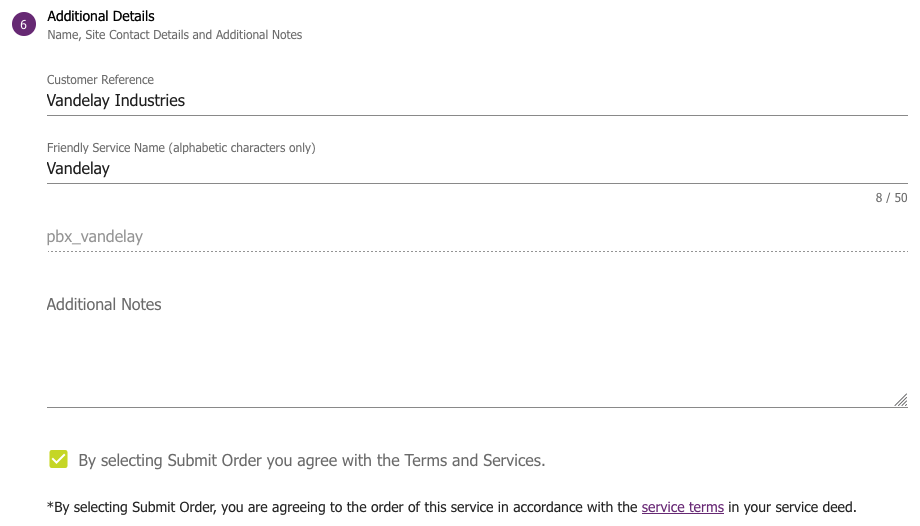

Enter the following information:

- **Customer Reference**: This will be used in our correspondance to you during the ordering process.

- **Friendly Name:** This will be allow you to identify the service in the Ember portal.

- **Additional Notes:** Anything else you think is relevant to the order.

Click the checkbox to agree to the Terms and Services.

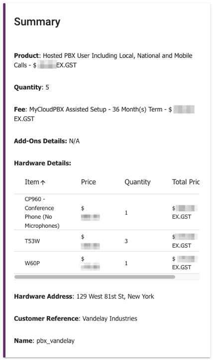

Review the Order Summary on the right hand side of the screen and make sure everything is correct.

Click '**Proceed To Order**'.

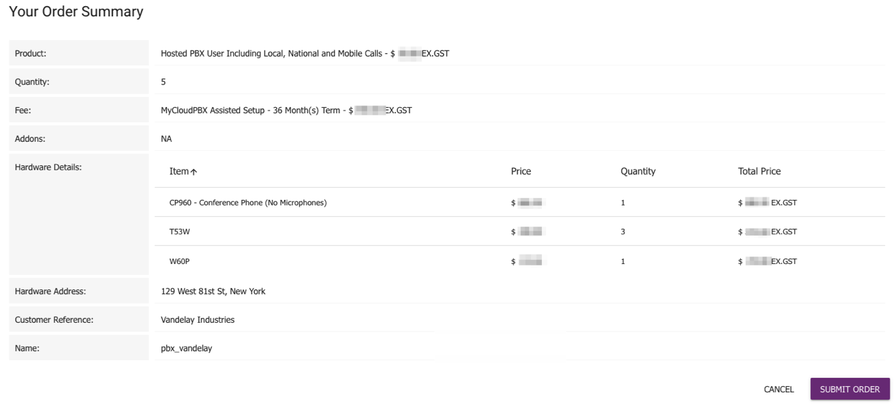

One final review of your order summary, then click '**Sumbit Order**' if everything is correct.

Your PBX will now be built and deployed automatically while you watch. 

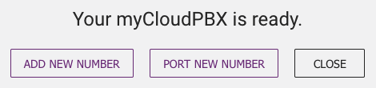

Once complete you will have the following options:

- **Add New Number**: This will take you to the New Number order screen.

- **Add New Number**: This will take you to the Number Manager, where you can port your numbers as required.

- **Close**: If you do not wish to port or add any numbers at this time.

Select as appropriate.

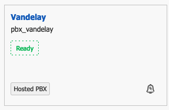

Your new PBX is now visible on the '**Services**' screen under the '**Voice**' tab and you can proceed with configuration.

### Business SIP

Order a new Business SIP service.

### Inbound 1300

Order or port 1300 & 1800 numbers.

### Manage Phone Numbers

Manage your existing phone numbers.

### Nbn Internet

Order Home nbn, Business nbn, or private Cloud Internet services.

### Fibre Services

Request a qualification for Ethernet and complex data services.

## Pricebook
View your pricebook.

## Call Tariffs 
View your call Tariffs.
